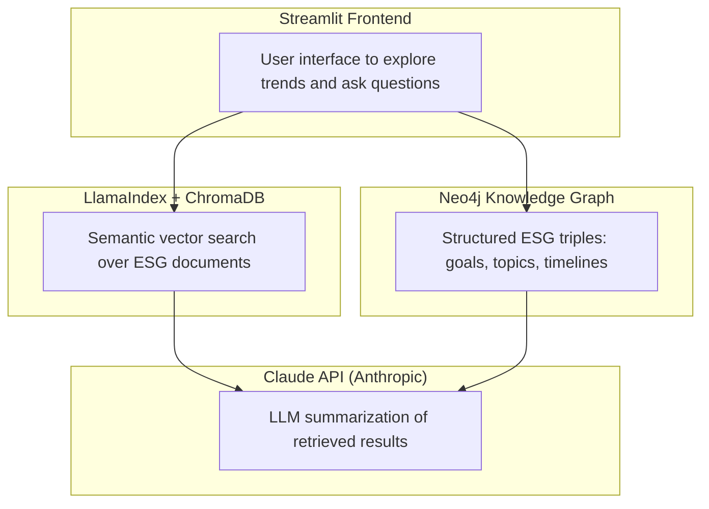

# 🌱 ESG Trend Insight Engine

**An LLM-powered content understanding and retrieval system for explainable ESG insights across companies and time.**

This project combines **GenAI (Claude), Retrieval-Augmented Generation (RAG), Knowledge Graphs, and topic modeling** to help users explore long-form ESG disclosures, uncover semantic patterns, and generate grounded, explainable insights.

---

## 🚀 Features

- 📊 **Keyword Trend Explorer**
  Visualize frequency of ESG themes (carbon, labor, governance, etc.) across time, companies, and industries.

- 🧠 **RAG-based ESG QA**
  Ask: _“What did Microsoft say about carbon in 2023?”_
  → Hybrid answers from both vector search and knowledge graph facts.

- 🔍 **Explainability Toggle**
  Toggle between:

  - Claude’s LLM summary
  - Neo4j-derived ESG facts
  - Retrieved document snippets

- 🧠 **Topic Modeling Layer**
  Discover top ESG themes per year using LDA and BERTopic.

- 📏 **Retrieval & Answer Evaluation**
  Measure retrieval quality, grounding, and failure modes using a curated ESG QA set.

---

## 🧱 Architecture

This project combines traditional NLP + modern retrieval + LLM summarization:



---

## 📊 Example Use Case

> **Q:** What were Microsoft’s ESG priorities in 2023?

**LLM Summary Output:**

- Carbon-free electricity investments
- Long-term carbon removal progress
- Focus on climate resilience

**KG Facts:**

- Microsoft AIMS_TO_ACHIEVE "carbon neutrality"
- Microsoft TARGET_YEAR "2030"

---

## 📏 Retrieval & Answer Evaluation

To assess retrieval quality and answer reliability, I implemented an initial evaluation framework on a curated set of **104 ESG-related questions**.

This was designed as a baseline evaluation layer to better understand system behaviour, retrieval failure modes, and opportunities for improvement.

### Metrics

- **Hit@5:** 0.279  
- **Recall@5:** 0.341  
- **Context Relevance:** 0.484  
- **Groundedness:** 0.284  

### Evaluation Setup

- Questions are mapped to expected **company-year document families**
- Retrieval is evaluated at the **family level** rather than individual chunks
- Metrics capture both:
  - **Retrieval accuracy** (Hit@K, Recall@K)
  - **Answer quality & grounding** (Context Relevance, Groundedness)

### Key Observations

- The system frequently retrieves **semantically relevant documents from the correct company but different years**
- This indicates that embedding-based retrieval captures **topic similarity** well, but struggles with **temporal specificity**
- Retrieval outputs often include multiple chunks from the same document family, reducing effective coverage in top-K results

### Insights & Next Steps

This evaluation highlights a clear opportunity to improve **metadata-aware retrieval**, particularly:

- **Year-aware ranking / filtering**
- **Document-level deduplication in top-K retrieval**
- Hybrid retrieval strategies combining **semantic similarity + structured signals** (company, year)

### Why This Matters

This evaluation framework establishes a foundation for:

- Measuring **content understanding quality**
- Diagnosing **retrieval failure modes** in long-form corporate reports
- Supporting future work in:
  - retrieval optimization
  - explainability
  - LLM-assisted annotation and evaluation workflows

---

## 🎬 Demo Video

[](https://github.com/dolcefarnienteleone/esg-trend-insight-engine/raw/main/media/esg_trend_insight_engine.MP4)

---

## 📂 Folder Structure

```Kotlin
esg-trend-insight-engine/
├── data/
│ ├── esg_corpus_by_year.csv
│ ├── keyword_trends_by_*.csv
│ └── lda_*_topics.txt
├── scripts/
│ ├── triple_extractor.py
│ ├── load_structured_esg_kg.py
│ ├── topic_modeling_by_year.py
│ └── plot_keyword_trends.py
├── retrievers/
│ ├── hybrid_esg_retriever_claude.py
│ └── esg_kg_query_runner.py
├── evaluation/
│ └── eval_retrieval_chroma.py
├── esg_explorer_app.py
└── README.md
```

---

## ⚙️ Tech Stack

- **GenAI / RAG**: Claude 3 + LlamaIndex
- **Embeddings**: HuggingFace MiniLM
- **Vector DB**: ChromaDB
- **Knowledge Graph**: Neo4j (structured ESG facts)
- **Topic Modeling**: LDA, BERTopic
- **Evaluation**: Retrieval metrics + grounding analysis
- **Frontend**: Streamlit

---

## ▶️ How to Run Locally

```bash
git clone https://github.com/your-username/esg-trend-insight-engine.git
cd esg-trend-insight-engine
pip install -r requirements.txt
streamlit run esg_explorer_app.py
```

## 🔐 Environment Variables

Create a `.env` file in the project root:

```ini
ANTHROPIC_API_KEY=your_claude_key
HUGGINGFACE_API_KEY=your_hf_key
neo4j_pw=your_neo4j_password
```

---

## 🚀 Deploy to Streamlit Cloud (Optional)

1. Push this repo to GitHub.
2. Go to **Streamlit Cloud** → **New app** → select your repo/branch.
3. Set **Main file** to `esg_explorer_app.py`.
4. Add Secrets (Environment variables):

- `ANTHROPIC_API_KEY`
- `HUGGINGFACE_API_KEY`
- `neo4j_pw`

⚠️ If you use Neo4j locally → switch to a hosted Neo4j instance or disable KG features for the cloud demo.

👉 **Live App**: https://your-app-name.streamlit.app

---

## 👤 Author

**Winnie Chen**
Data Scientist · Applied AI · NLP · ESG Analytics

🔗 [LinkedIn](https://www.linkedin.com/in/wanningchen)
🌐 [Portfolio](https://dolcefarnienteleone.github.io/#)

---

## 🧠 Why I Built This

This project explores how AI can make long-form corporate disclosures more **searchable, interpretable, and explainable**.

It was built to demonstrate how **semantic retrieval, structured knowledge, and evaluation frameworks** can work together to support better content understanding and grounded insight generation.

Core components include:

- Topic modeling & keyword trend analysis
- Retrieval (LlamaIndex + ChromaDB)
- Reasoning & summarization (Claude)
- Structured facts (Neo4j Knowledge Graph)
- Retrieval & grounding evaluation
